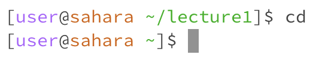
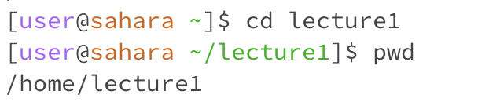
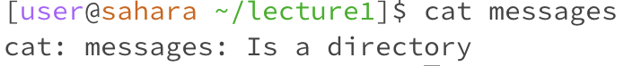
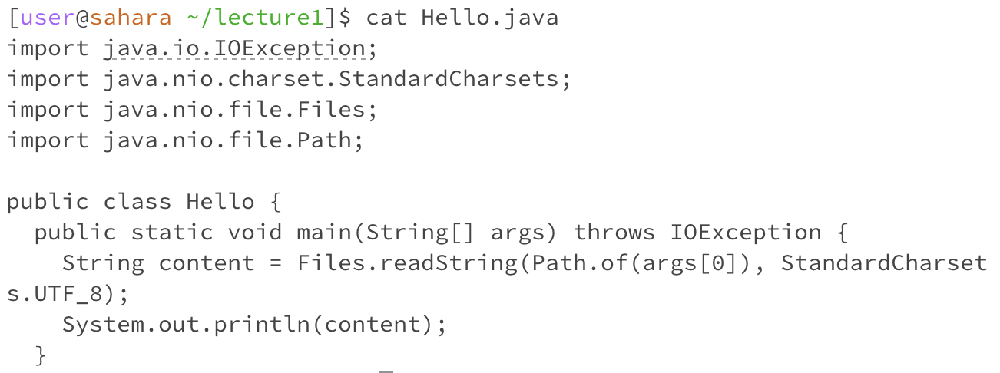

For each of the commands cd, ls, and cat, and using the workspace you created in this lab:
1. Share an example of using the command with no arguments.
2. Share an example of using the command with a path to a directory as an argument.
3. Share an example of using the command with a path to a file as an argument.

For commands `cd`:
Using the command with no argument:
Command: `cd`
Working directory: `/home`
Output: No output to this command, as it changes the directory to the user's home directory
Explanation: Running `cd` without arguments will default to changing the working directory to the user's home directory. There is no error here.

Using the command with a path to a directory as an argument:
Command: `cd lecture1`
Working Directory: `/home/lecture1`
Output: No visible output
Explanation: This command will change the working directory from `/home` to `/home/lecture1`, there should be no error as `lecture1` exists

Using the command with a path to a file as an argument:
Command: `cd Hello.java`
Working Directory: `/home/lecture1`
Output: `bash: cd: Hello.java: Not a directory`
ExplanationL This command fails as `Hello.java` is a file, not a directory. While `cd` needs a directory as its argument, the error will occur.

For commands `ls`:
Using the command with no argument:
Command: `ls`
Working directory: `/home/lecture1`
Output: `Hello.class  Hello.java  messages  README`
Explanation:`ls` will list the contents of the `lecture1` directory, showing `Hello.java`,`README`, and the `messages` directory

Using the command with a path to a directory as an argument:
Command: `ls messages`
Working directory: `/home/lecture1`
Output:`en-us.txt  es-mx.txt  zh-cn.txt`
Explanation: The command will list contents of the directory `messages` inside `lecture1`, showing the text files inside as shown in the output.

Using the command with a path to a file as an argument:
Command: `ls Hello.java`
Working directory: `/home/lecture1`
Output: `Hello.java`
Explanation: The command will confirm the existence of `Hello.java` file in the `lecture1` directory.

For commands `cat`:
Using the command with no argument:
Command: `cat`
Working directory: `/home/lecture1`
Output: No output
Explanation: As `cat` will read the user input to write standard output, as there's no input here, there won't be an output here.

Using the command with a path to a directory as an argument:
Command: `cat messages`
Working directory: `/home/lecture1`
Output:`cat: messages: Is a directory`
Explanation: It causes an error because `cat` expects a file path, not a directory.

Using the command with a path to a file as an argument:
Command:`cat Hello.java`
Working directory: `/home/lecture1`
Output: 
import java.io.IOException;
import java.nio.charset.StandardCharsets;
import java.nio.file.Files;
import java.nio.file.Path;

public class Hello {
  public static void main(String[] args) throws IOException {
    String content = Files.readString(Path.of(args[0]), StandardCharset
s.UTF_8);    
    System.out.println(content);
  }
  
Explanation: The command will display the content of code `Hello.java`, as `Hello.java` exists as a file in the `lecture1` directory. 

