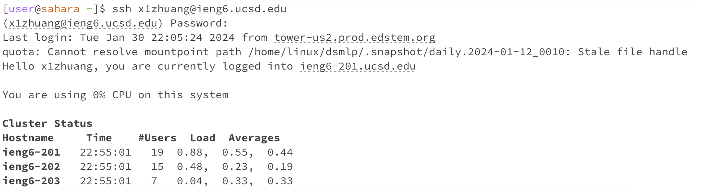

Part1  
~~~
import java.io.IOException;
import java.net.URI;

class Handler implements URLHandler {
    private StringBuilder chatHistory = new StringBuilder();

    public String handleRequest(URI url) {
        if (url.getPath().equals("/")) {
            return chatHistory.toString().isEmpty() ? "No messages yet." : chatHistory.toString();
        } else if (url.getPath().contains("/add-message")) {
            String query = url.getQuery();
            String[] queryParams = query.split("&");
            String user = "";
            String message = "";
            
            for (String param : queryParams) {
                String[] keyValue = param.split("=");
                if (keyValue[0].equals("user")) {
                    user = keyValue[1];
                } else if (keyValue[0].equals("s")) {
                    message = keyValue[1];
                }
            }
            
            if (!user.isEmpty() && !message.isEmpty()) {
                chatHistory.append(user).append(": ").append(message).append("\n");
                return "Message added!\n" + chatHistory.toString();
            } else {
                return "Incorrect format. Usage: /add-message?s=<message>&user=<username>";
            }
        } else {
            return "404 Not Found!";
        }
    }
}

class ChatServer {
    public static void main(String[] args) throws IOException {
        if(args.length == 0){
            System.out.println("Missing port number! Try any number between 1024 to 49151");
            return;
        }

        int port = Integer.parseInt(args[0]);

        Server.start(port, new Handler());
    }
}
~~~

Part2  
Q1 The absolute path to the private key for your SSH key for logging into `ieng6`

Q2 The absolute path to the public key for your SSH key for logging into `ieng6`

Q3 A terminal interaction where you log into your `ieng6` account without being asked for a password.

Part3  
From week 2 and week 3, there are several things I learned that I didn't know before. I learned how to create the web server which is completely new and interesting to me. I also learned how to ssh into a remote server, which is also very new to me that you can use computers to get access to other computeres.

