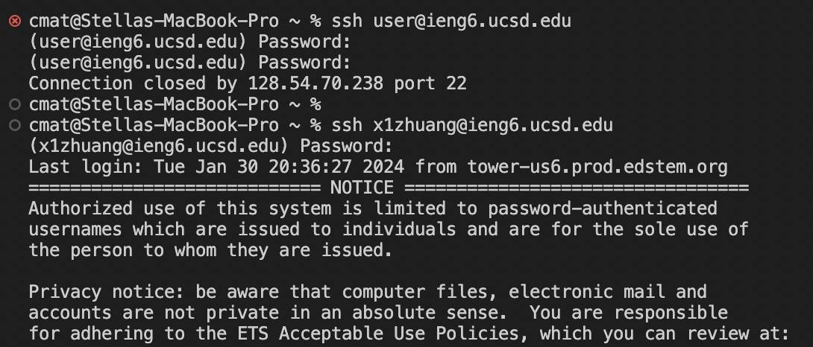
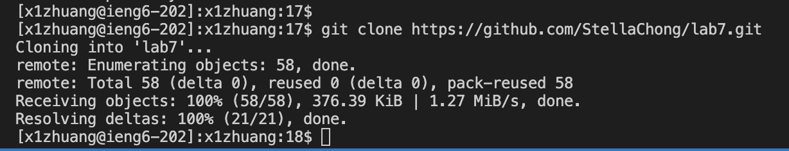
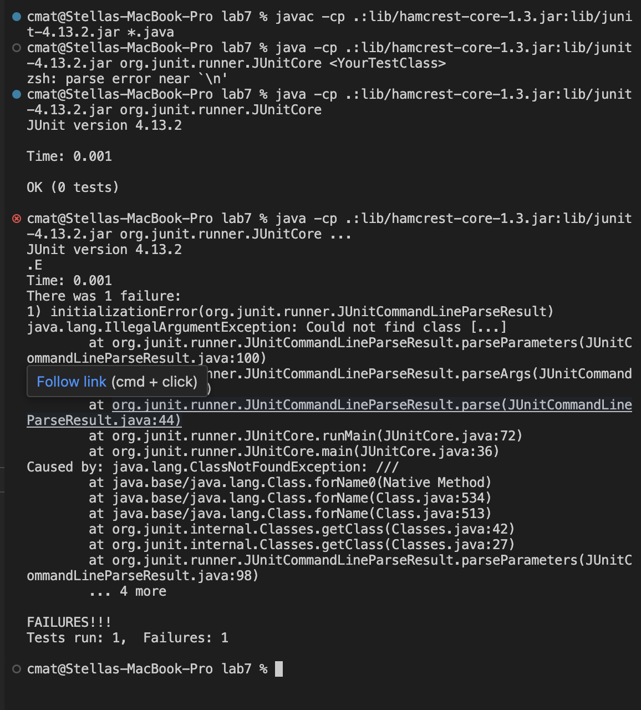

Lab Report 4
Step4
screenshot:

Command: `ssh username@ieng6.ucsd.edu`
keys pressed: `ssh`<space>`x1zhuang@ieng6.ucsd.edu`<enter>
Effect: By using the command ssh, I securely connected to the UCSD ieng6 server.

Step5
screenshot:

Command: `git clone` clonelink
keys pressed:`git`<space>`clone`<space>`git@github.com:StellaChong/lab7.git`<enter>
Effect: Cloned the lab7 repository to the local workspace.

Step6
screenshot:

Command: `javac -cp .:lib/hamcrest-core-1.3.jar:lib/junit-4.13.2.jar *.java`
`java -cp .:lib/hamcrest-core-1.3.jar:lib/junit-4.13.2.jar org.junit.runner.JUnitCore ListExamplesTest`
keys pressed:`<up><up><up><up><enter>` to compile, then `<up><up><up><up><enter>` to run tests
Effect: Compiled the Java files and ran the unit tests, confirming the fix worked.

Step7
screenshot:

Command:
`vim ListExamples.java`  
Key pressed: `vim` <space> `ListExamples.java` <enter>
`/index1` <enter> `n`  `cw` `index2` <esc> `:wq` <enter>
Effect: Opened ListExamples.java file in Vim editor, searched for index1, replaced the first instance with index2. Saved the file and exited Vim.
